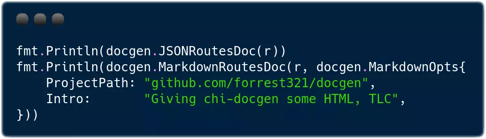

# `docgen-yes`

This Git repo is a maintained fork of [`docgen`](https://github.com/go-chi/docgen). Here all PRs are welcome. The upstream `docgen` is more conservative.

The libraries `docgen` and `docgen-yes` both auto-generates routing documentation for a `chi` Router from your app source.

## Differences

The upstream `docgen` is very stable, while `docgen-yes` includes experimental new features.

Generator  | `docgen` | `docgen-yes`
-----------|----------|--------------
JSON       | ✔ Stable | ✔ Minor enahcements
Markdown   | ✔ Stable | ✔ Minor enahcements
HTML       | ✖        | ✔ Experimental

## Example

[Example use of the JSON and Markdown generators](https://github.com/go-chi/chi/blob/master/_examples/rest/main.go#L105).


(screenshot made with [Carbon](https://carbon.now.sh) and retouched with [GIMP](https://en.wikipedia.org/wiki/GIMP))

## `import`

### Upstream `docgen`

```go
import (
  "net/http"

  "github.com/go-chi/chi/v5"
  "github.com/go-chi/docgen"
)
```

### To use this fork

```go
import (
  "net/http"

  "github.com/go-chi/chi/v5"
  "github.com/teal-finance/docgen-yes" // note the change
)
```

## Experimental HTML generator

* Templates built, passing tests
* HTML Generator is being built, not yet functional (3/18/2018)
  * 85% complete
  * 15% remaining: String building for routes, middleware, handlers & related tests
* Configuration obj
* New code inspired from markdown.go
* See markup.go and markupTemplates.go
* Designed & implemented by [forrest321](https://github.com/forrest321/docgen)

## Build

    go build

## Test

    go test -race
    go test -race ./...

Tests generated by [cweill/gotests](https://github.com/cweill/gotests)
