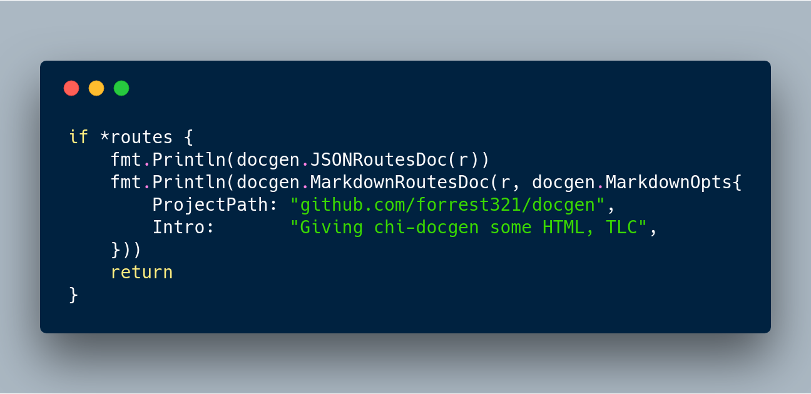

# docgen

Auto-generate routing documentation in JSON, Markdown, or Markup (HTML) for a `chi` Router from your app source.

* Tests generated by [cweill/gotests](https://github.com/cweill/gotests)
* Vendoring with [github.com/tools/godep](https://github.com/tools/godep)
* Using Go [.gitignore Template](https://github.com/github/gitignore/blob/master/Go.gitignore)
* Code Screenshot made with [Carbon](https://carbon.now.sh)

## fork info

In Process

* Building HTML generation with optional web server
  * Templates built, passing tests
  * HTML Generator is being built, not yet functional (3/18/2018)
    * 85% complete
    * 15% remaining: String building for routes, middleware, handlers & related tests
  * Web Server - code written, need to bring into prj
  * Configuration obj

Check markup.go & markupTemplates.go for new code, started from a copy of markdown.go.

Build uses godep for vendoring. Install with:
> $> go get -u github.com/tools/godep

To Install:
> $> go get -u github.com/forrest321/docgen

To Build:
> $>godep go build

To Test:
> $>godep go test

To Use:

See [an example use of the Markdown Generator](https://github.com/go-chi/chi/blob/4c5a584b324b74af3e9cfeaf6265d14ae2fdfc99/_examples/rest/main.go#L105)

